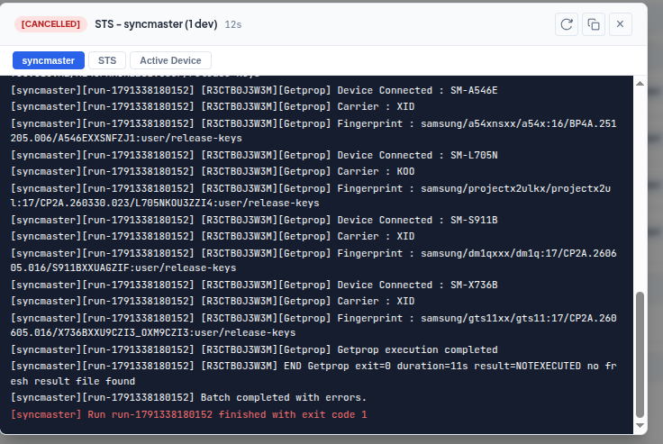
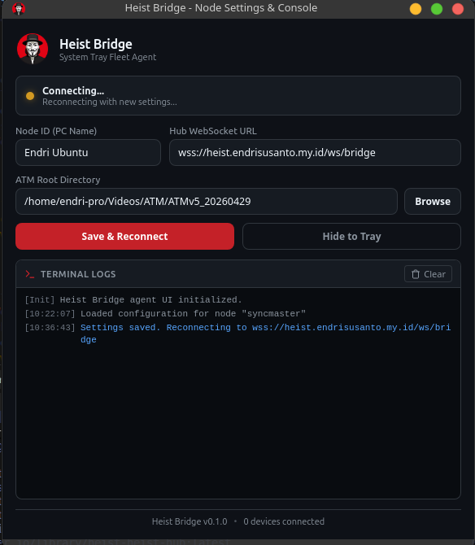
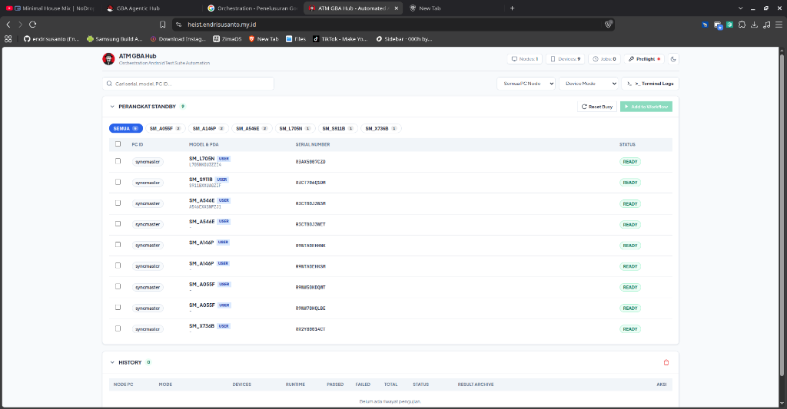

# Heist

<p align="center">
  
</p>

<h3 align="center">Centralized Android Fleet Test Orchestration Engine and System Tray Bridge</h3>

---

## Overview

Heist is a distributed test automation platform migrated from ATM Bersama. It separates the orchestration web interface from execution nodes:

- **Heist Web Hub**: Central web dashboard and WebSocket orchestrator served via Docker at `https://heist.endrisusanto.my.id`.
- **Heist Bridge**: Lightweight Rust and Tauri desktop agent running on each test PC node. It discovers connected ADB devices and triggers test suites without requiring open inbound network ports.

---

## Screenshots

| Web Hub Dashboard | Workflow and Test Execution |
| :---: | :---: |
|  |  |
| **Heist Bridge Desktop Agent** | **Mobile Responsive View** |
|  |  |

---

## Test Results and Archive Packaging

Test runs generate individual and master archives grouped by device PDA version:

1. **Testcase Archive (`{Testcase}_{PDA Version}.zip`)**:
   - `Getprop_{PDA}.zip`: Contains device build properties (`Getprop_XID.txt`).
   - `BVT_{PDA}.zip`: Contains compatibility reports (`bvt_result.xml`, `checksum.data`, `compatibility_result.css`, `compatibility_result.xsd`, `compatibility_result.xsl`, `logo.png`).
   - `SVT_{PDA}.zip`: Contains preload app inspection files (`svt_result.xml`, `preload_apps.json`, `csc_feature_report.xml`).
   - `SDT_{PDA}.zip`: Contains device diagnostic data (`XID_SDT.xml`, `sensor_diagnostics.txt`, `device_test_summary.json`).

2. **Master Result Archive (`ATM_{PDA Version}.zip`)**:
   - Bundles all individual testcase zip archives into a single master package with an execution summary:
     ```
     ATM_A055FXXSIDZI3.zip
     ├── Getprop_A055FXXSIDZI3.zip
     ├── BVT_A055FXXSIDZI3.zip
     ├── SVT_A055FXXSIDZI3.zip
     ├── SDT_A055FXXSIDZI3.zip
     └── summary.txt
     ```

---

## Repository Structure

```
Heist/
├── branding/                      # Official mascot, logos, and raw image assets
├── bridge/                        # Tauri v2 System Tray Fleet Agent (Rust)
│   ├── icons/                     # Multi-resolution application icons
│   ├── resources/                 # Bundled Java batch launcher
│   ├── src/                       # Rust engine (scanner, runner, preflight, WS client)
│   └── ui/                        # Settings and logs popup window
├── docs/                          # Documentation and screenshot assets
│   └── screenshots/               # Interface preview captures
├── web-hub/                       # Central Web and WebSocket Hub
│   ├── server/                    # Node.js server and WebSocket router
│   └── client/                    # Vite and TypeScript web dashboard
├── .github/workflows/release.yml  # Multi-platform CI/CD (.deb and .msi)
├── Dockerfile                     # Multi-stage container build
├── docker-compose.yml             # Container orchestration
└── package.json                   # Root workspace manifest
```

---

## Getting Started

### 1. Running Heist Hub Locally

```bash
# Install dependencies
npm install

# Build client and server
npm run build

# Start Hub server (Default port: 4020)
npm start
```

Open `http://localhost:4020` in your browser.

### 2. Deploying with Docker

```bash
docker compose up -d --build
```

### 3. Running Heist Bridge (PC Node)

```bash
cd bridge
cargo build --release
```

Run the compiled executable:
- **Linux**: `./target/release/heist-bridge`
- **Windows**: `.\target\release\heist-bridge.exe`

Click the system tray icon to configure `Node ID`, `Hub URL`, and `ATM Root Directory`.

---

## Building Release Packages

Push a semantic version tag to trigger GitHub Actions:

```bash
git tag v0.1.0
git push origin v0.1.0
```

GitHub Actions will build and attach:
- `Heist Bridge .deb` (Ubuntu / Debian)
- `Heist Bridge .msi` (Windows)
directly to the GitHub Release.

---

## License

Internal test automation platform.
