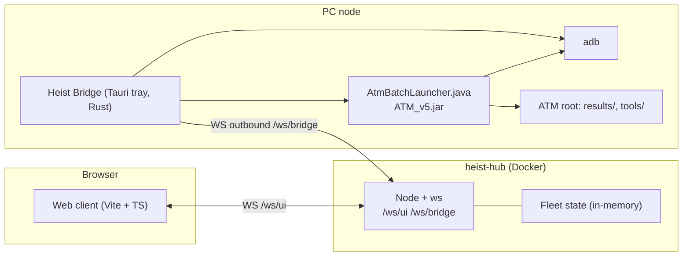

# Migrasi ATM ke Web App + Bridge Tauri (AppTray)

## Goal Description

ATM Bersama (`atm-tauri-launcher`, Tauri + Vanilla JS + Rust) saat ini menjalankan semuanya di satu PC. UI mengirim perintah lewat Tauri IPC ke Rust, lalu Rust memanggil ADB dan runner Java (`AtmBatchLauncher.java` → `ATM_v5.jar`).

Tujuan: UI pindah ke **web app** di hub sendiri. Eksekusi ADB/Java tetap di PC node lewat **bridge Tauri yang hidup di system tray**, terhubung ke hub lewat WebSocket outbound. Pola mengikuti proyek `AUTO → Agent` (`/home/endri-pro/Videos/Agent`: `agent-bridge` + `web-hub`).

Keputusan yang sudah disepakati:
- **Hub ATM terpisah** (repo dan container sendiri), pola sama dengan Agent.
- **`atm-tauri-launcher` dibiarkan utuh** sampai web stabil. Bridge adalah binary baru.
- **scrcpy mirror dan CTS Verifier interaktif ditunda**, di luar scope awal.
- Antislop diterapkan selama implementasi.
- **Nama produk: Heist.** Repo: `github.com/endrisusanto/Heist`, dikloning ke `/home/endri-pro/Videos/Heist` dan jadi root monorepo. Bridge tray bernama **Heist Bridge**.
- **Build installer `.deb` dan `.msi` lewat GitHub Actions di repo Heist**, dipicu tag `v*`.
- **Domain web-hub: `heist.endrisusanto.my.id`** (publik, HTTPS). UI di `https://heist.endrisusanto.my.id/`, bridge connect ke `wss://heist.endrisusanto.my.id/ws/bridge`, UI ke `wss://heist.endrisusanto.my.id/ws/ui`.
- **Logo dan app icon** dari `/home/endri-pro/Downloads/CUCIAN/Heist.png` (500×500 RGBA, topeng Dalí berkerudung merah).

> [!NOTE]
> Akses tool ke `/run/media/endri-pro/BINARY_HDD/AUTO` diblokir policy. Saya membaca AUTO lewat shell (read-only). Rujukan arsitektur utama adalah `/home/endri-pro/Videos/Agent` dan `architecture_plan.md` dari sesi sebelumnya.

## Arsitektur



Bridge selalu membuka koneksi keluar, jadi PC node tidak perlu port terbuka.

## Pemetaan Tauri command → pesan WS

| Tauri command sekarang | Pesan Hub→Bridge | Scope |
| :--- | :--- | :--- |
| `list_devices` | (push periodik) `DEVICE_LIST_UPDATE` | Fase 1 |
| `preflight` | `CMD_PREFLIGHT` | Fase 1 |
| `run_batch` | `CMD_RUN_BATCH {run_id, devices, tools, concurrency, update}` | Fase 1 |
| `cancel_batch` | `CMD_CANCEL_RUN {run_id}` | Fase 1 |
| `update_tools` | `CMD_UPDATE_TOOLS` | Fase 1 |
| `set_device_lamp`, `press_device_home` | `CMD_SET_LAMP`, `CMD_PRESS_HOME` | Fase 2 |
| `clear_results` | `CMD_CLEAR_RESULTS` | Fase 2 |
| `open_native_scrcpy`, `open_scrcpy_wrap` | tidak dimigrasi | Ditunda |
| `*_cts_verifier*` (7 command) | tidak dimigrasi | Ditunda |

Event Tauri `atm-run-log` dan `atm-run-finished` menjadi `LOG_STREAM` dan `RUN_FINISHED` dari bridge ke hub.

Pesan Bridge→Hub: `REGISTER_NODE {pcId, os, atmRoot, version}`, `DEVICE_LIST_UPDATE`, `LOG_STREAM {run_id, line}`, `RUN_FINISHED {run_id, exit_code, devices}`, `PREFLIGHT_REPORT`.
Pesan UI↔Hub: `FLEET_STATE` (snapshot), `TRIGGER_RUN`, `CANCEL_RUN`.

## Proposed Changes

Semua kode baru berada di repo Heist (`/home/endri-pro/Videos/Heist`), di luar `atm-tauri-launcher`, supaya app lama tidak tersentuh. Folder di bawah relatif terhadap root repo Heist.

```
Heist/
├── bridge/            # Tauri tray (Rust)
├── web-hub/{server,client}
├── branding/Heist.png # sumber logo + icon
├── .github/workflows/release.yml
├── Dockerfile, docker-compose.yml, package.json, README.md
└── atm_web_migration_plan.md
```

### 0. Branding (logo + app icon)

#### [NEW] `branding/Heist.png`, `bridge/src-tauri/icons/*`, `web-hub/client/public/{logo.png,favicon.ico}`
- Salin `Heist.png` ke `branding/`.
- Generate semua ukuran icon dengan `npx tauri icon branding/Heist.png` (menghasilkan `32x32.png`, `128x128.png`, `icon.ico`, `icon.icns`, dll.). Gambar sudah persegi 500×500, jadi tidak perlu dipotong. Tauri menyarankan sumber ≥1024px; 500px cukup untuk tray/installer, tapi akan di-upscale untuk `.icns`.
- Ikon tray: pakai `32x32.png` dari hasil generate (latar transparan, terbaca di tray gelap maupun terang karena kerudung merah kontras).
- Web: `logo.png` di header sidebar, `favicon.ico`, dan `<title>Heist</title>`. Palet aksen UI diambil dari gambar: merah kerudung `#D2232A`, merah gelap `#8E1A1E`, kulit `#F6D8A8`, hitam `#111`.

### 1. Struktur monorepo

#### [NEW] `package.json`, `Dockerfile`, `docker-compose.yml`, `README.md`
Workspace npm untuk `web-hub/server` dan `web-hub/client`. Dockerfile multi-stage seperti Agent (build client + server, serve statis dari server). Port default `4020` agar tidak bentrok dengan `agent-web-hub` (4010).

**Deploy domain `heist.endrisusanto.my.id`:**
- Container `heist-hub` hanya listen HTTP di `4020`; TLS dan routing domain ditangani reverse proxy/tunnel di depannya (Agent tidak punya konfigurasi proxy di repo, jadi saya asumsikan Anda sudah punya satu untuk domain `*.endrisusanto.my.id`).
- Proxy wajib meneruskan WebSocket upgrade untuk `/ws/bridge` dan `/ws/ui`, dan timeout idle ≥ 60 detik. Hub kirim ping tiap 25 detik agar koneksi tidak diputus proxy.
- Karena endpoint publik, `BRIDGE_TOKEN` jadi **wajib** (hub menolak start tanpa token), dan `/ws/ui` diberi pengaman (lihat Open Questions soal auth).
- Server juga memeriksa header `Origin` di `/ws/ui`, hanya menerima `https://heist.endrisusanto.my.id` (dan `http://localhost:*` saat dev).
- `.env.example`: `PORT=4020`, `BRIDGE_TOKEN=`, `PUBLIC_ORIGIN=https://heist.endrisusanto.my.id`.

### 2. `bridge` (Heist Bridge: Rust + Tauri tray)

#### [NEW] `bridge/`
- `Cargo.toml`: `tauri` dengan fitur `tray-icon`, `tokio`, `tokio-tungstenite`, `serde`, `serde_json`, `hostname`. Tanpa `axum` dan `reqwest`, tidak perlu.
- `tauri.conf.json`: `productName: "Heist Bridge"`, jendela kecil `visible: false`, bundle `deb` dan `msi` (`rpm` dibuang, tidak diminta), identifier `com.heist.bridge` agar tidak konflik dengan `com.atm.batch.launcher`, `icon` menunjuk hasil `tauri icon`.
- `src/main.rs`: tray (menu Status, Buka config, Quit), close-window = sembunyikan ke tray, loop WS dengan auto-reconnect (backoff 1s→30s).
- `src/scanner.rs`: porting `list_devices` (adb devices + getprop) dari `atm-tauri-launcher/src-tauri/src/main.rs` baris ~101-235.
- `src/runner.rs`: porting `run_batch` / `cancel_batch` (baris ~242-640): spawn Java launcher, pipe stdout/stderr ke `LOG_STREAM`, guard device sibuk, cancel file, watchdog.
- `src/preflight.rs`: porting `preflight`.
- `ui/`: halaman config minimal: `PC_ID`, `HUB_URL` (default `wss://heist.endrisusanto.my.id/ws/bridge`), `BRIDGE_TOKEN`, `ATM root` (pakai `rfd` untuk pilih folder). Dev lokal bisa override ke `ws://localhost:4020/ws/bridge`.

Kode ADB/runner disalin dulu, bukan di-extract jadi crate bersama. Alasannya: app lama tidak boleh berubah. Jika nanti app lama dipensiunkan, duplikasi hilang dengan sendirinya.

> [!IMPORTANT]
> Launcher Java di `resources/atm-batch-launcher/` perlu ikut dibundel ke bridge (seperti `tauri.conf.json` ATM sekarang), karena `run_batch` menyalinnya ke `<ATM root>/atm-batch-launcher`.

### 3. `web-hub/server` (Node + TypeScript)

#### [NEW] `atm-web/web-hub/server/src/index.ts`
- `ws` untuk `/ws/bridge` dan `/ws/ui`; HTTP statis untuk client.
- State fleet di memori: `Map<pcId, {devices, activeRuns, lastSeen}>`. Tidak ada DB (YAGNI).
- Routing: `TRIGGER_RUN` → bridge target; `LOG_STREAM` → UI; ring buffer log per `run_id` (mis. 5000 baris) untuk UI yang baru terhubung.
- Token bridge sederhana via header (`BRIDGE_TOKEN` env) agar bukan sembarang klien bisa mendaftar.

### 4. `web-hub/client` (Vite + TypeScript)

#### [NEW] `atm-web/web-hub/client/`
Port layout dari `atm-tauri-launcher/src/main.js` + `styles.css` (1445 + 1425 baris, Vanilla JS):
- Sidebar kiri: kartu device (model, serial, Android, SPL, PDA/build, modem, CSC), dikelompokkan per PC node.
- Tengah: toolbar pilih tools, concurrency, tombol Run/Cancel, kartu progress per device.
- Kanan: metrik ringkasan dan log berjalan (live dari `LOG_STREAM`).
- Preflight modal.
- Tema gelap/terang memakai token CSS yang sudah ada di `styles.css`.

Framework: **Vanilla TS + Vite**, bukan React. Alasan: sumber sudah Vanilla JS, jadi port lebih langsung dan tanpa dependensi UI. Agent memakai React; jika mau seragam, bilang saja.

### 5. Rilis (`.deb` + `.msi` di repo Heist)

#### [NEW] `.github/workflows/release.yml`
Trigger: push tag `v*`. Dua job paralel, hasilnya diunggah ke GitHub Release dengan `softprops/action-gh-release@v2`. Berbeda dari Agent (yang memakai `build-deb.sh` custom), di sini cukup `tauri-apps/tauri-action` supaya satu konfigurasi menghasilkan kedua format (ponytail: tanpa script build manual).

```yaml
name: Release
on:
  push:
    tags: ['v*']
permissions:
  contents: write
jobs:
  build:
    strategy:
      fail-fast: false
      matrix:
        include:
          - os: ubuntu-22.04
            args: --bundles deb
          - os: windows-latest
            args: --bundles msi
    runs-on: ${{ matrix.os }}
    steps:
      - uses: actions/checkout@v4
      - uses: dtolnay/rust-toolchain@stable
      - uses: actions/setup-node@v4
        with: { node-version: 20 }
      - if: runner.os == 'Linux'
        run: |
          sudo apt-get update
          sudo apt-get install -y libgtk-3-dev libwebkit2gtk-4.1-dev libayatana-appindicator3-dev librsvg2-dev patchelf
      - uses: tauri-apps/tauri-action@v0
        env:
          GITHUB_TOKEN: ${{ secrets.GITHUB_TOKEN }}
        with:
          projectPath: bridge
          tagName: ${{ github.ref_name }}
          releaseName: 'Heist Bridge ${{ github.ref_name }}'
          args: ${{ matrix.args }}
```

Catatan: versi di `tauri.conf.json` harus sama dengan tag. `.msi` memakai WiX, tersedia di runner `windows-latest`. Tanpa code signing, Windows akan menampilkan peringatan SmartScreen (lihat Open Questions).

## Fase Eksekusi

1. **Skeleton + branding + protokol**: clone Heist, `tauri icon`, monorepo, hub server dengan `REGISTER_NODE` dan `FLEET_STATE`, bridge tray (ikon Heist) yang connect dan tampil di UI.
2. **Device scan**: scanner.rs + kartu device realtime di web.
3. **Run batch**: runner.rs, `TRIGGER_RUN`, log streaming, cancel, guard sibuk.
4. **Preflight, update tools, lampu, home, clear results**.
5. **Packaging**: Docker hub, `release.yml`, tes tag `v0.1.0-rc1` untuk `.deb` dan `.msi`.

## Verification Plan

### Automated Tests
- `cargo build --release` dan `cargo test` di `bridge/src-tauri/`.
- `npx tauri build --bundles deb` lokal; cek `dpkg-deb -I` dan ikon terpasang.
- Push tag `v0.1.0-rc1` ke Heist; kedua job Actions hijau dan Release berisi `.deb` + `.msi`.
- `npm run build` di `web-hub/server` dan `web-hub/client`.
- Test protokol Node kecil: bridge palsu (`ws` client) mendaftar, kirim device list dan log; UI palsu menerima `FLEET_STATE` dan `LOG_STREAM`.
- `docker compose up -d --build` lalu `curl -fsS localhost:4020/` harus 200.

### Manual Verification
1. Jalankan bridge di PC ini; ikon tray (topeng Heist) muncul, tutup jendela = tetap hidup. Install `.deb` dan `.msi` hasil Actions, ikon app tampil di menu aplikasi.
2. Web menampilkan PC node dan device ADB yang tersambung.
3. Jalankan `getprop` pada satu device dari web; log mengalir dan folder `results/<model>/...` terisi sama seperti app lama.
4. Cancel dari web menghentikan proses Java dan membersihkan guard sibuk.
5. Matikan hub: bridge reconnect otomatis, run yang sedang berjalan tidak mati.
6. Bandingkan hasil dengan `atm-tauri-launcher` untuk device dan tool yang sama.

## Open Questions

> [!IMPORTANT]
> 1. ~~**Lokasi hub**~~ Diputuskan: publik di `heist.endrisusanto.my.id`. Yang masih perlu dikonfirmasi: reverse proxy/tunnel apa yang dipakai (Cloudflare Tunnel, nginx, Caddy) dan di mesin mana hub berjalan? Apakah DNS sudah mengarah?
> 2. **Auth**: karena publik, token bridge bersama tidak cukup untuk UI. Pilihan: (a) login sederhana (user/password dari env, cookie sesi), (b) Cloudflare Access/basic auth di proxy, (c) tanpa auth (tidak disarankan, siapa pun bisa menjalankan ADB di PC node). Rekomendasi: (a) atau (b).
> 3. **Windows**: bridge ikut dibuat untuk `msi` sejak awal (ATM saat ini mendukung Windows)? Akan menambah pengujian di Windows.
> 4. **Hasil run**: hub cukup menampilkan ringkasan dan log, atau perlu download hasil dari node lewat hub (seperti `ResultsExplorer` Agent)? Saya asumsikan ringkasan saja untuk fase 1.
> 5. **Framework client**: Vanilla TS (rekomendasi) atau React seperti Agent?
> 6. **Repo Heist**: apakah sudah berisi kode (perlu merge) atau kosong? Saya tidak bisa melihat isinya dari sini, dan folder lokal `/home/endri-pro/Videos/Heist` belum berupa git repo. Saya asumsikan kosong dan akan `git clone` ke folder ini.
> 7. **Code signing `.msi`**: lewati dulu (SmartScreen akan memperingatkan) atau sediakan sertifikat sebagai GitHub secret?
> 8. **`.rpm`**: dibuang dari plan karena hanya `.msi` dan `.deb` yang diminta. Perlu dikembalikan?

## Tantangan Integrasi CTS Verifier (Fase 6, opsional)

Sumber: `atm-tauri-launcher/src-tauri/src/main.rs` (7 command `*_cts_verifier*`, baris ~644-1200 dan ~1557-2200). Saat ini ditunda dari fase 1-5. Alurnya: install `CtsVerifier.apk` + `AutoCtsVerifier-debug.apk` (+ `-androidTest`), jalankan `adb shell am instrument` per test case, parse `INSTRUMENTATION_STATUS`, lalu ekspor laporan dari device.

| # | Tantangan | Kenapa sulit | Usulan |
| :-- | :--- | :--- | :--- |
| 1 | **Distribusi APK** | Folder `Normal/` dan `ApkTest/` berisi banyak APK per versi Android, dicari lewat 7+ lokasi (`CTS_VERIFIER_RESOURCE_DIR`, `<ATM root>/resources`, dll). `.deb`/`.msi` jadi sangat besar jika dibundel, dan APK ber-versi mengikuti rilis Android. | Jangan bundel. Bridge memakai `<ATM root>/resources` yang sudah ada di PC node; hub hanya menampilkan status "APK ditemukan/tidak" lewat preflight. |
| 2 | **Test interaktif butuh manusia** | Banyak test CTS Verifier meminta tap, menyentuh sensor, atau mengamati layar. Automation (`AutoCtsVerifier`) hanya menutup sebagian. Operator web jauh dari device fisik. | Batasi ke test yang diotomasi `AutoCtsVerifier`. Test manual tetap dilakukan langsung di PC node. |
| 3 | **Ekspor via UI scraping** | `trigger_cts_verifier_export` memakai `keyevent 82`, `uiautomator dump`, lalu tap koordinat menu "Export". Rapuh terhadap bahasa, versi UI, dan layar terkunci. | Port apa adanya ke `cts.rs`; tampilkan error jelas ke web. Tidak diperbaiki di migrasi (di luar scope). |
| 4 | **Path laporan tidak pasti** | Laporan dicari di 10+ path device (`/sdcard/verifierReports`, `Android/data/com.android.cts.verifier/files`, dst.) plus glob. Beda OEM/Android, beda lokasi. | Salin daftar path persis; jangan diubah. |
| 5 | **Run lama + log deras** | `am instrument` punya timeout total dan idle (`CTS_VERIFIER_TEST_TIMEOUT_SECS`, `..._IDLE_TIMEOUT_SECS`). Run bisa puluhan menit; log per test sangat banyak. Proxy publik bisa memutus WS idle. | Heartbeat `LOG_STREAM` per test, ring buffer hub 5000 baris sudah cukup; ping 25 detik sudah ada. Timeout tetap di bridge. |
| 6 | **Hasil tidak bisa dilihat di hub** | Laporan (XML/ZIP) ditarik ke `<ATM root>/results/.../CTSVerifier` di PC node, bukan hub. | Fase awal: hub hanya tampilkan ringkasan pass/fail dari `INSTRUMENTATION_STATUS`. Download laporan lewat hub bergantung jawaban Open Question 4. |
| 7 | **Konfigurasi test dinamis** | UI memuat `ListTestCaseAvailable.json` dan `TestCaseToActivity.json` dari asset, lalu `get_cts_verifier_config` menimpa dengan versi dari APK/ATM root. Daftar test di web bisa tidak sinkron dengan node. | Bridge mengirim `CTS_CONFIG` saat `REGISTER_NODE`; web memakai itu, bukan asset statis. |
| 8 | **Konflik dengan run Java** | `pendingJavaAfterCts` di UI: Java runner menunggu CTS selesai di device yang sama. `guard device sibuk` harus mencakup CTS, kalau tidak dua proses `adb` berebut device. | Guard sibuk di `runner.rs` dibagi dengan `cts.rs` (satu `HashSet<serial>`). |
| 9 | **Keamanan** | Hub publik memicu `adb install` dan `am instrument` di PC node. | Terkena keputusan auth (Open Question 2); CTS jangan aktif sebelum auth UI ada. |
| 10 | **Windows** | `adb`, path, dan `uiautomator` sama, tapi path APK dan `sync` perlu dites ulang. | Masuk uji manual `.msi`. |

Usulan ponytail: jangan bangun apa-apa untuk CTS sampai fase 1-5 stabil. Saat dikerjakan, port `cts.rs` sebagai salinan dan hanya expose 3 aksi: **install**, **run test case**, **tarik laporan**. `open_cts_verifier`, `start_cts_verifier_activity`, dan `cleanup` tetap lokal.
